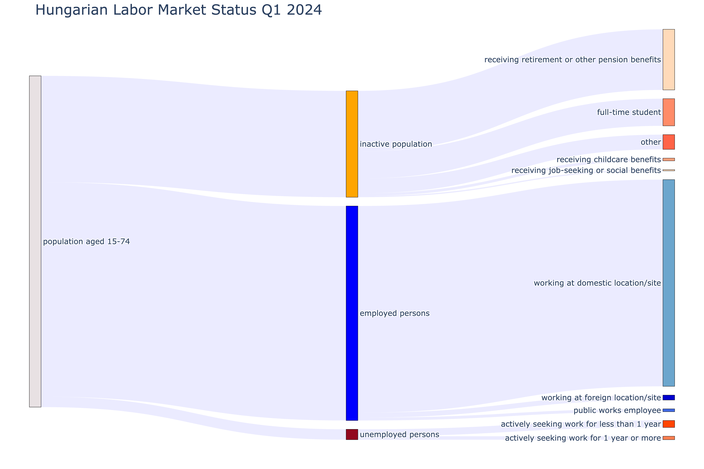

### Labor Market Analysis using Sankey Diagrams

Sankey diagrams are utilized to visually represent labor market dynamics among the population aged 15-74. Data sourced from the Hungarian Central Statistical Office provides insights into these dynamics [(source)](https://www.ksh.hu/stadat_files/melleklet/munkaero-evkozi-15-74-eves-nepesseg-statusza.pdf).

Read the full article on Medium: [Visualizing Labor Market Trends: The Power of Sankey Diagrams](https://medium.com/@datafoxhu/visualizing-labor-market-trends-the-power-of-sankey-diagrams-8b9dba8f20cf)
